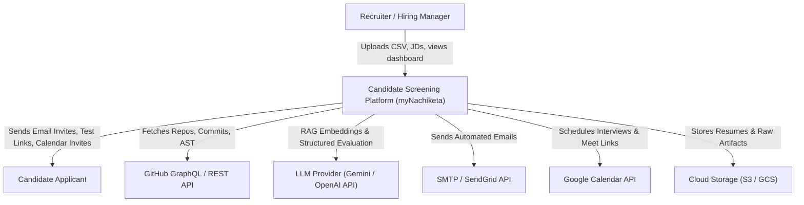
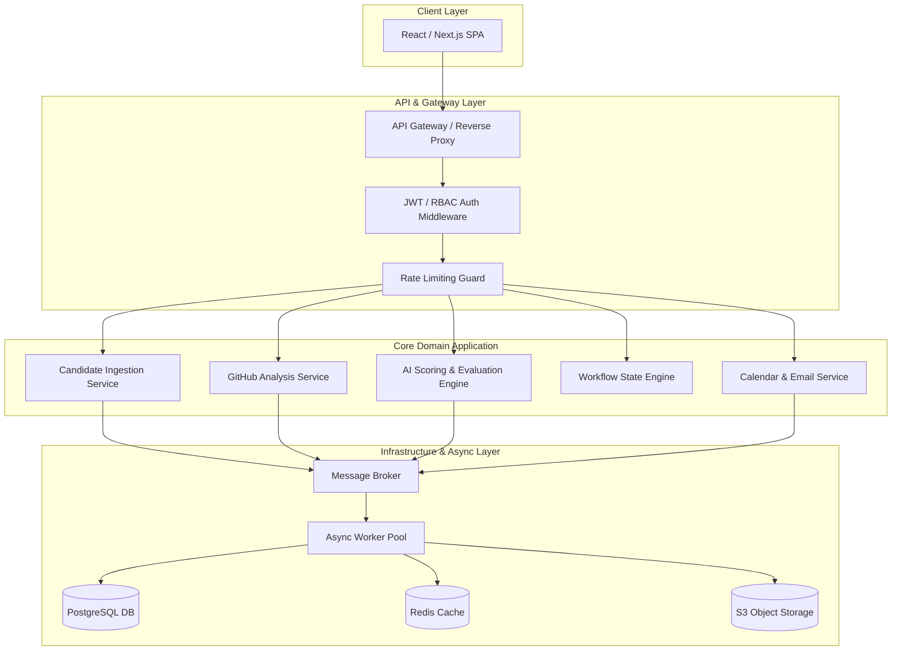
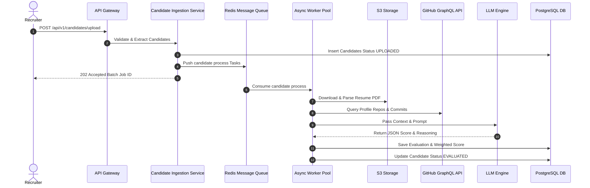
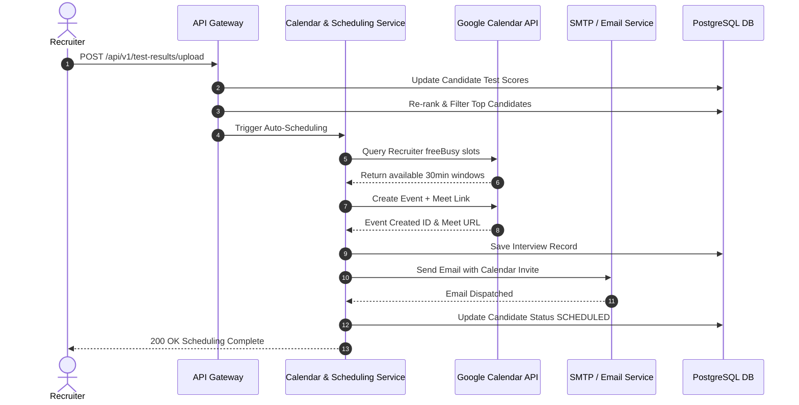
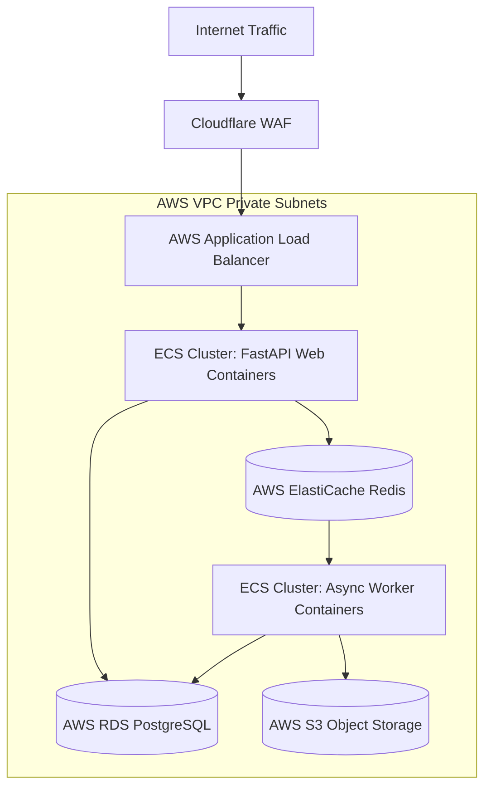
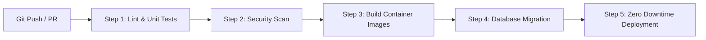

# Principal-Level System Architecture Specification
**System Name:** AI Candidate Screening & Workflow Automation Platform (*myNachiketa*)  
**Architect:** Principal Software Architect  
**Architecture Pattern:** Clean Architecture / Modular Monolith with Event-Driven Async Workers  
**Target Environment:** Production Cloud Infrastructure (AWS / GCP / Kubernetes)  

---

## 1. System Overview & Clean Architecture Principles

The system is designed following **Clean Architecture** and **Domain-Driven Design (DDD)** principles to guarantee:
* **Independence of Frameworks**: Business logic is completely decoupled from web frameworks, DB drivers, or AI SDKs.
* **Testability**: Core domain entities and use cases can be unit-tested without external DB or network dependencies using **Dependency Injection (DI)**.
* **Maintainability & No Code Duplication**: DRY enforcement via shared domain primitives and repository interfaces.
* **Extensibility**: Cloud-agnostic interfaces allow swapping storage (S3/GCS), databases (PostgreSQL), queues (Redis/RabbitMQ/SQS), and LLM providers (Gemini/OpenAI/Anthropic) via configuration.

---

## 2. System Context & Component Diagrams

### 2.1 C4 Level 1: System Context Diagram



### 2.2 C4 Level 3: Component Diagram (Modular Architecture)



---

## 3. Sequence Diagrams

### 3.1 E2E Candidate Ingestion & AI Evaluation Pipeline



### 3.2 Shortlisting & Automatic Google Calendar / Meet Scheduling



---

## 4. Database Schema (PostgreSQL DDL)

```sql
-- Enable Extensions
CREATE EXTENSION IF NOT EXISTS "uuid-ossp";
CREATE EXTENSION IF NOT EXISTS "pgcrypto";
CREATE EXTENSION IF NOT EXISTS "vector";

-- Enum Definitions
CREATE TYPE candidate_status AS ENUM (
    'UPLOADED',
    'PARSED',
    'EVALUATED',
    'SHORTLISTED_L1',
    'TEST_SENT',
    'TEST_COMPLETED',
    'SHORTLISTED_L2',
    'INTERVIEW_SCHEDULED',
    'REJECTED'
);

-- Table: Job Descriptions
CREATE TABLE job_descriptions (
    id UUID PRIMARY KEY DEFAULT uuid_generate_v4(),
    title VARCHAR(255) NOT NULL,
    description TEXT NOT NULL,
    required_skills TEXT[] NOT NULL,
    min_experience_years INT DEFAULT 0,
    created_at TIMESTAMP WITH TIME ZONE DEFAULT CURRENT_TIMESTAMP,
    updated_at TIMESTAMP WITH TIME ZONE DEFAULT CURRENT_TIMESTAMP
);

-- Table: Candidates
CREATE TABLE candidates (
    id UUID PRIMARY KEY DEFAULT uuid_generate_v4(),
    name VARCHAR(255) NOT NULL,
    email VARCHAR(255) UNIQUE NOT NULL,
    college VARCHAR(255),
    branch VARCHAR(100),
    cgpa NUMERIC(3, 2) CHECK (cgpa >= 0.0 AND cgpa <= 10.0),
    best_ai_project TEXT,
    research_work TEXT,
    github_handle VARCHAR(100),
    resume_url TEXT NOT NULL,
    status candidate_status DEFAULT 'UPLOADED',
    created_at TIMESTAMP WITH TIME ZONE DEFAULT CURRENT_TIMESTAMP,
    updated_at TIMESTAMP WITH TIME ZONE DEFAULT CURRENT_TIMESTAMP
);

-- Table: GitHub Profiles (Cached Data)
CREATE TABLE github_profiles (
    id UUID PRIMARY KEY DEFAULT uuid_generate_v4(),
    candidate_id UUID NOT NULL REFERENCES candidates(id) ON DELETE CASCADE,
    public_repos INT DEFAULT 0,
    total_stars INT DEFAULT 0,
    primary_languages JSONB,
    engineering_effort_index NUMERIC(5, 2),
    raw_payload JSONB,
    fetched_at TIMESTAMP WITH TIME ZONE DEFAULT CURRENT_TIMESTAMP
);

-- Table: Candidate Evaluations
CREATE TABLE candidate_evaluations (
    id UUID PRIMARY KEY DEFAULT uuid_generate_v4(),
    candidate_id UUID NOT NULL REFERENCES candidates(id) ON DELETE CASCADE,
    job_description_id UUID NOT NULL REFERENCES job_descriptions(id),
    resume_score NUMERIC(5, 2) NOT NULL CHECK (resume_score >= 0 AND resume_score <= 100),
    github_score NUMERIC(5, 2) NOT NULL CHECK (github_score >= 0 AND github_score <= 100),
    aptitude_score NUMERIC(5, 2) CHECK (aptitude_score >= 0 AND aptitude_score <= 100),
    coding_score NUMERIC(5, 2) CHECK (coding_score >= 0 AND coding_score <= 100),
    composite_score NUMERIC(5, 2) NOT NULL CHECK (composite_score >= 0 AND composite_score <= 100),
    ai_reasoning JSONB NOT NULL,
    embedding vector(1536), -- Vector representation for similarity search
    evaluated_at TIMESTAMP WITH TIME ZONE DEFAULT CURRENT_TIMESTAMP
);

-- Table: Interviews
CREATE TABLE interviews (
    id UUID PRIMARY KEY DEFAULT uuid_generate_v4(),
    candidate_id UUID NOT NULL REFERENCES candidates(id) ON DELETE CASCADE,
    google_event_id VARCHAR(255) NOT NULL,
    google_meet_url TEXT NOT NULL,
    start_time TIMESTAMP WITH TIME ZONE NOT NULL,
    end_time TIMESTAMP WITH TIME ZONE NOT NULL,
    interviewer_email VARCHAR(255) NOT NULL,
    status VARCHAR(50) DEFAULT 'SCHEDULED',
    created_at TIMESTAMP WITH TIME ZONE DEFAULT CURRENT_TIMESTAMP
);

-- Indexes for Query Optimization
CREATE INDEX idx_candidates_email ON candidates(email);
CREATE INDEX idx_candidates_status ON candidates(status);
CREATE INDEX idx_evaluations_composite ON candidate_evaluations(composite_score DESC);
CREATE INDEX idx_evaluations_candidate_jd ON candidate_evaluations(candidate_id, job_description_id);
```

---

## 5. API Design (RESTful Specification)

### 5.1 Endpoints Summary
| Method | Endpoint | Description | Request Body | Response |
| :--- | :--- | :--- | :--- | :--- |
| `POST` | `/api/v1/jobs` | Create Job Description | `{ title, description, skills }` | `201 Created` |
| `POST` | `/api/v1/candidates/upload` | Upload Candidates CSV | `multipart/form-data (file, job_id)` | `202 Accepted` |
| `GET` | `/api/v1/candidates` | Get Ranked Candidates | Query: `job_id, status, limit, offset` | `200 OK` |
| `POST` | `/api/v1/test-results/upload` | Upload Test Results CSV | `multipart/form-data (file)` | `200 OK` |
| `POST` | `/api/v1/interviews/schedule` | Trigger Auto-Scheduling | `{ candidate_ids[], duration_mins }` | `200 OK` |

### 5.2 OpenAPI Sample Schema (Candidate Upload Response)

```json
{
  "status": "success",
  "data": {
    "batch_id": "c7a8b9f1-3d2e-4b5a-9f1a-8c7b6a5d4e3f",
    "total_candidates_queued": 150,
    "estimated_completion_time_seconds": 120
  },
  "meta": {
    "timestamp": "2026-07-24T14:49:50Z"
  }
}
```

---

## 6. Clean Architecture Folder Structure

```
src/
├── domain/                      # Pure Business Rules (No Framework Dependencies)
│   ├── entities/
│   │   ├── candidate.py
│   │   ├── evaluation.py
│   │   └── interview.py
│   ├── value_objects/
│   │   ├── email.py
│   │   └── score.py
│   └── interfaces/              # Repository & Port Interfaces
│       ├── candidate_repository.py
│       ├── llm_provider.py
│       ├── github_client.py
│       └── calendar_client.py
│
├── application/                 # Use Cases & Application Logic
│   ├── use_cases/
│   │   ├── ingest_candidate_csv.py
│   │   ├── evaluate_candidate.py
│   │   ├── shortlist_candidates.py
│   │   └── schedule_interview.py
│   ├── dtos/
│   └── service_interfaces/
│
├── infrastructure/              # Frameworks, DB Drivers & External Adapters
│   ├── persistence/
│   │   ├── postgres_candidate_repo.py
│   │   └── models.py
│   ├── external_services/
│   │   ├── gemini_llm_adapter.py
│   │   ├── github_graphql_adapter.py
│   │   ├── google_calendar_adapter.py
│   │   └── smtp_email_adapter.py
│   ├── messaging/
│   │   ├── redis_broker.py
│   │   └── celery_workers.py
│   └── security/
│       ├── ssrf_proxy.py
│       └── prompt_sanitizer.py
│
└── presentation/                # Delivery Mechanism (HTTP REST APIs / CLI)
    ├── api/
    │   ├── v1/
    │   │   ├── candidates_router.py
    │   │   ├── evaluation_router.py
    │   │   └── scheduling_router.py
    │   └── middlewares/
    └── main.py                  # Dependency Injection Wiring & App Entrypoint
```

---

## 7. Async Queue & Worker Topology

```
+------------------+         +------------------+         +-----------------------+
| Ingestion Worker |         | GitHub Worker    |         | AI Evaluation Worker  |
+------------------+         +------------------+         +-----------------------+
         ^                            ^                               ^
         |                            |                               |
[ Queue: candidate.ingest ]  [ Queue: github.analyze ]   [ Queue: ai.evaluate ]
         ^                            ^                               ^
         +----------------------------+-------------------------------+
                                      |
                           [ Redis Message Broker ]
                                      |
                         [ Queue: notification.send ]
                                      v
                         +--------------------------+
                         | Email & Calendar Worker  |
                         +--------------------------+
```

### Fault Tolerance & Retry Policies
* **Dead-Letter Queue (DLQ)**: Tasks failing $> 3$ retries move to `dlq:candidate_processing` for inspection.
* **Exponential Backoff**: $T_{\text{backoff}} = 2^{\text{retry}} \times \text{Base} + \text{FullJitter}$.
* **Idempotency**: Every task payload carries a `task_id` idempotency key to prevent duplicate processing.

---

## 8. AI Pipeline & Structured Evaluation Engine

### 8.1 Prompt Injection Guardrail Architecture

```
Raw Candidate Resume / README Text
               │
               v
 [ Regex Sanitizer & Delimiter Cleaner ]
               │
               v
 [ Delimiter Wrapping: <candidate_context> ... </candidate_context> ]
               │
               v
 [ Strict JSON Schema System Prompt Injection ]
               │
               v
      [ LLM API Execution ]
```

### 8.2 LLM Scoring Prompt Matrix
* **Inputs**: Target Job Description, Extracted Resume Text, GitHub Profile Summary, Best AI Project Description.
* **Outputs**: Enforced Strict JSON Object matching the database schema.
* **Multi-Model Fallback Chain**: Primary: `Gemini 1.5 Flash` $\rightarrow$ Secondary: `Claude 3.5 Haiku` $\rightarrow$ Fallback: `Local Ollama / Llama 3`.

---

## 9. Cloud Deployment & Container Topology



---

## 10. Security Architecture

1. **Authentication & Access Control**: JWT authentication using RSA-256 signatures; RBAC roles (`RECRUITER`, `ADMIN`).
2. **SSRF Guard Proxy**: Sanitizes resume download URLs. Pre-resolves domain names and blocks private/internal IP ranges (`10.0.0.0/8`, `172.16.0.0/12`, `192.168.0.0/16`, `169.254.169.254`).
3. **Data Protection at Rest & Transit**: TLS 1.3 for all HTTP interfaces; AES-256 for PostgreSQL disk storage; Google OAuth 2.0 refresh tokens stored in KMS / HashiCorp Vault.

---

## 11. Monitoring, Logging & Observability

### 11.1 Prometheus Metrics
* **Candidate Process Rate**: `rate(candidate_processing_success_total[5m])`
* **LLM Latency & Cost**: `histogram_quantile(0.95, sum(rate(llm_request_duration_seconds_bucket[5m])) by (le))`
* **Async Queue Backlog Size**: `redis_queue_length{queue="ai.evaluate"}`

### 11.2 Structured JSON Logging Format

```json
{
  "timestamp": "2026-07-24T14:49:50.123Z",
  "level": "INFO",
  "correlation_id": "req-8f9a0b1c-2d3e",
  "service": "ai_scoring_engine",
  "candidate_id": "c7a8b9f1-3d2e-4b5a-9f1a-8c7b6a5d4e3f",
  "message": "Candidate AI scoring completed successfully",
  "metrics": {
    "llm_token_count": 1420,
    "latency_ms": 1150,
    "composite_score": 91.50
  }
}
```

---

## 12. CI/CD Pipeline Workflow



---

## 13. Architectural Trade-offs Analysis

| Architectural Decision | Chosen Option | Alternative Option | Trade-off Rationale |
| :--- | :--- | :--- | :--- |
| **Monolith vs Microservices** | **Modular Monolith** | Distributed Microservices | Lower operational complexity for current scope while preserving clear domain boundaries via Clean Architecture for easy future split. |
| **Database & Vector Search** | **PostgreSQL + Pgvector** | Postgres + Pinecone / Qdrant | Single database engine simplifies transaction consistency (ACID), backup strategy, and hosting overhead. |
| **Async Queue Engine** | **Redis + Celery** | Apache Kafka | Redis provides lower latency and simpler infrastructure management for low-to-medium throughput event queues. |
| **LLM Evaluation Strategy** | **Multi-Model Fallback API** | Fine-tuned Local Model | Cloud APIs eliminate GPU infrastructure costs and offer higher reasoning quality for un-structured resume evaluation. |
